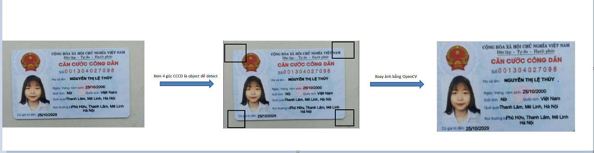
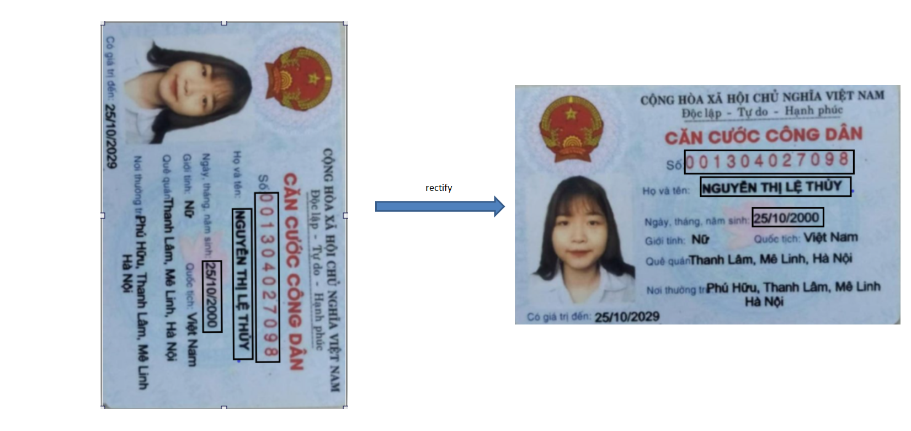
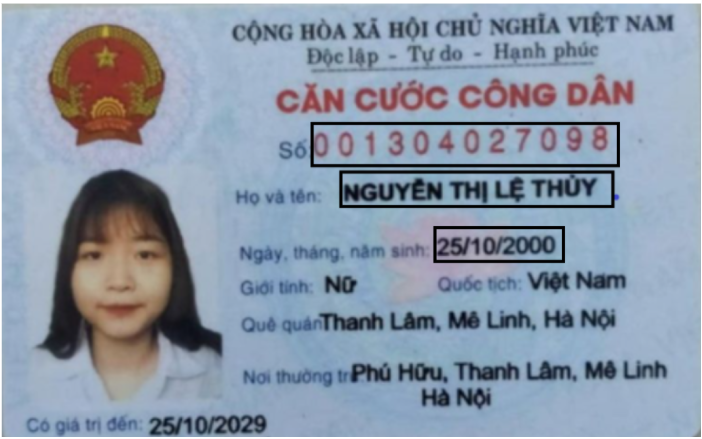

# IDCardVNRecognition

## Giới thiệu
Đây là demo đơn giản sử dụng thư viện streamlit của python (https://streamlit.io/) về hệ thống trích rút thông tin từ thẻ CMND/CCCD.

Dưới đây là các bước chính của hệ thống:
#### Bước 1: Crop và xoay ảnh sử dụng Object Detection để detect 4 góc CMND và thư viện OpenCV.



Nếu ảnh không được crop (không phát hiện được 4 góc của CMND), hệ thống thực hiện rectify ảnh bằng cách sử dụng text detection để đưa ra các textbox và text classification để
dự đoán hướng của từng textbox, từ đó xoay ảnh về đúng hướng. 



#### Bước 2: Xem các vùng thông tin là 1 object và sử dụng Object Detection để detect.



#### Bước 3: Sử dụng Text Recognition để nhận diện text cho từng vùng thông tin.

## CÀI ĐẶT
**Environments**
- Python 3.6
- Linux OS

**Clone source code**
```
git clone https://github.com/ndcuong91/MC_OCR.git
cd IDCardVNRecognition
```
**Cài đặt môi trường Conda**
```
conda env create -f environment.yml
```

## Run demo
```
streamlit run demo.py
```
<i> Note: Có thể điều chỉnh tham số <strong>gpu</strong> trong file <strong>modules/config.py</strong> để sử dụng gpu trong quá trình inference.</i> 