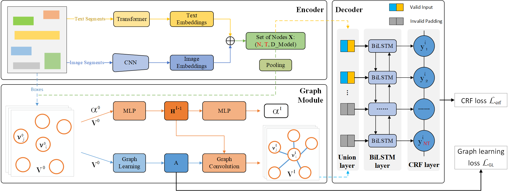

# PICK-PyTorch
PyTorch reimplementation of ["PICK: Processing Key Information Extraction from Documents using Improved Graph 
Learning-Convolutional Networks"](https://arxiv.org/abs/2004.07464) (ICPR 2020). This project is different from 
our original implementation.

<!-- @import "[TOC]" {cmd="toc" depthFrom=1 depthTo=6 orderedList=false} -->

<!-- code_chunk_output -->

* Contents
    * [Introduction](#introduction)
	* [Requirements](#requirements)
	* [Usage](#usage)
		* [Distributed training with config files](#distributed-training-with-config-files)
		* [Using Multiple Node](#using-multiple-node)
		* [Resuming from checkpoints](#resuming-from-checkpoints)
		* [Testing from checkpoints](#testing-from-checkpoints)
	* [Customization](#customization)
	    * [Training custom datasets](training-custom-datasets)
		* [Checkpoints](#checkpoints)
        * [Tensorboard Visualization](#tensorboard-visualization)
	* [Results on Train Ticket](#results-on-train-ticket)
    * [TODOs](#todos)
    * [Citations](#citations)
	* [License](#license)
	* [Acknowledgements](#acknowledgements)

<!-- /code_chunk_output -->

## Introduction
PICK is a framework that is effective and robust in handling complex documents layout for Key Information Extraction (KIE) by 
combining graph learning with graph convolution operation, yielding a richer semantic representation 
containing the textual and visual features and global layout without ambiguity. Overall architecture shown follows.



## Requirements
* python = 3.6 
* torchvision = 0.6.1
* tabulate = 0.8.7
* overrides = 3.0.0
* opencv_python = 4.3.0.36
* numpy = 1.16.4
* pandas = 1.0.5
* allennlp = 1.0.0
* torchtext = 0.6.0
* tqdm = 4.47.0
* torch = 1.5.1
```bash
pip install -r requirements.txt
```

## Usage

### Distributed training with config files
Modify the configurations in `config.json` and `dist_train.sh` files, then run:
```bash
bash dist_train.sh
```
The application will be launched via `launch.py` on a 4 GPU node with one process per GPU (recommend).

This is equivalent to
```bash
python -m torch.distributed.launch --nnode=1 --node_rank=0 --nproc_per_node=4 \
--master_addr=127.0.0.1 --master_port=5555 \
train.py -c app.json -d 1,2,3,4 --local_world_size 4
```
and is equivalent to specify indices of available GPUs by `CUDA_VISIBLE_DEVICES` instead of `-d` args
```bash
CUDA_VISIBLE_DEVICES=1,2,3,4 python -m torch.distributed.launch --nnode=1 --node_rank=0 --nproc_per_node=4 \
--master_addr=127.0.0.1 --master_port=5555 \
train.py -c app.json --local_world_size 4
```
Similarly, it can be launched with a single process that spans all 4 GPUs (if node has 4 available GPUs) 
using (don't recommend):
```bash
CUDA_VISIBLE_DEVICES=1,2,3,4 python -m torch.distributed.launch --nnode=1 --node_rank=0 --nproc_per_node=1 \
--master_addr=127.0.0.1 --master_port=5555 \
train.py -c app.json --local_world_size 1
```
### Using Multiple Node
You can enable multi-node multi-GPU training by setting `nnode` and `node_rank` args of the commandline line on every node.
e.g., 2 nodes 4 gpus run as follows
  
  Node 1, ip: 192.168.0.10, then run on node 1 as follows
  ```
CUDA_VISIBLE_DEVICES=1,2,3,4 python -m torch.distributed.launch --nnode=2 --node_rank=0 --nproc_per_node=4 \
--master_addr=192.168.0.10 --master_port=5555 \
train.py -c config.json --local_world_size 4  
```
   Node 2, ip: 192.168.0.15, then run on node 2 as follows
  ```
CUDA_VISIBLE_DEVICES=2,4,6,7 python -m torch.distributed.launch --nnode=2 --node_rank=1 --nproc_per_node=4 \
--master_addr=192.168.0.10 --master_port=5555 \
train.py -c config.json --local_world_size 4  
```
  
### Resuming from checkpoints
You can resume from a previously saved checkpoint by:

  ```
  python -m torch.distributed.launch --nnode=1 --node_rank=0 --nproc_per_node=4 \
--master_addr=127.0.0.1 --master_port=5555 \
train.py -d 1,2,3,4 --local_world_size 4 --resume path/to/checkpoint
  ```
  
### Testing from checkpoints
You can test from a previously saved checkpoint by:

  ```
  python test.py --checkpoint path/to/checkpoint --boxes_transcripts path/to/boxes_transcripts \
                 --images_path path/to/images_path --output_folder path/to/output_folder \
                 --gpu 0 --batch_size 2
  ```
  
## Customization

### Training custom datasets
You can train you own datasets following the steps outlined below.
1. Prepare the correct format of files as provided in `data` folder.
   * Please see [data/README.md](data/README.md) an instruction how to prepare the data in required format for PICK.
2. Modify `train_dataset` and  `validation_dataset` args in `config.json` file, including `files_name`, 
`images_folder`, `boxes_and_transcripts_folder`, `entities_folder`, `iob_tagging_type` and `resized_image_size`. 
3. Modify `Entities_list` in `utils/entities_list.py` file according to the entity type of your dataset.
4. Modify `MAX_BOXES_NUM` and `MAX_TRANSCRIPT_LEN` in `data_tuils/documents.py` file. (Optional)

**Note**: The self-build datasets our paper used cannot be shared for patient privacy and proprietary issues.

### Checkpoints
You can specify the name of the training session in `config.json` files:
  ```json
  "name": "PICK_Default",
  "run_id": "output_test"
  ```

The checkpoints will be saved in `save_dir/name/run_id_timestamp/checkpoint_epoch_n`, with timestamp in mmdd_HHMMSS format.

A copy of `config.json` file will be saved in the same folder.

**Note**: checkpoints contain:
  ```python
  {
    'arch': arch,
    'epoch': epoch,
    'state_dict': self.model.state_dict(),
    'optimizer': self.optimizer.state_dict(),
    'monitor_best': self.monitor_best,
    'app': self.config
  }
  ```

### Tensorboard Visualization
This project supports Tensorboard visualization by using either  `torch.utils.tensorboard` or [TensorboardX](https://github.com/lanpa/tensorboardX).

1. **Install**

    If you are using pytorch 1.1 or higher, install tensorboard by 'pip install tensorboard>=1.14.0'.

    Otherwise, you should install tensorboardx. Follow installation guide in [TensorboardX](https://github.com/lanpa/tensorboardX).

2. **Run training** 

    Make sure that `tensorboard` option in the config file is turned on.

    ```
     "tensorboard" : true
    ```

3. **Open Tensorboard server** 

    Type `tensorboard --logdir saved/log/` at the project root, then server will open at `http://localhost:6006`

By default, values of loss  will be logged. If you need more visualizations, use `add_scalar('tag', data)`, `add_image('tag', image)`, etc in the `trainer._train_epoch` method.
`add_something()` methods in this project are basically wrappers for those of `tensorboardX.SummaryWriter` and `torch.utils.tensorboard.SummaryWriter` modules. 

**Note**: You don't have to specify current steps, since `WriterTensorboard` class defined at `logger/visualization.py` will track current steps.

## Results on Train Ticket


## TODOs
- [ ] Dataset cache mechanism to speed up training loop
- [x] Multi-node multi-gpu setup (DistributedDataParallel)

## Citations
If you find this code useful please cite our [paper](https://arxiv.org/abs/2004.07464):
```bibtex
@inproceedings{Yu2020PICKPK,
  title={{PICK}: Processing Key Information Extraction from Documents using 
  Improved Graph Learning-Convolutional Networks},
  author={Wenwen Yu and Ning Lu and Xianbiao Qi and Ping Gong and Rong Xiao},
  booktitle={2020 25th International Conference on Pattern Recognition (ICPR)},
  year={2020}
}
```

## License
This project is licensed under the MIT License. See LICENSE for more details.

## Acknowledgements
This project structure takes example by [PyTorch Template Project](https://github.com/victoresque/pytorch-template).
